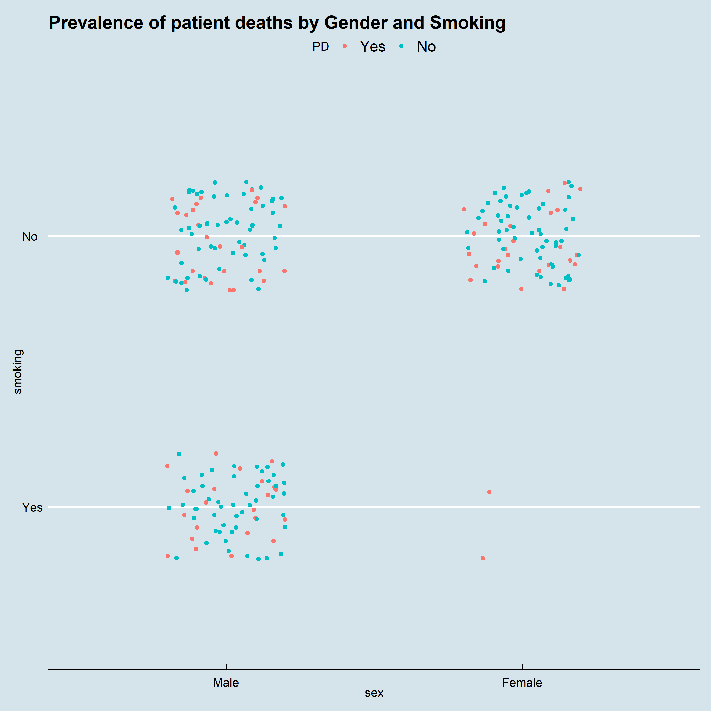
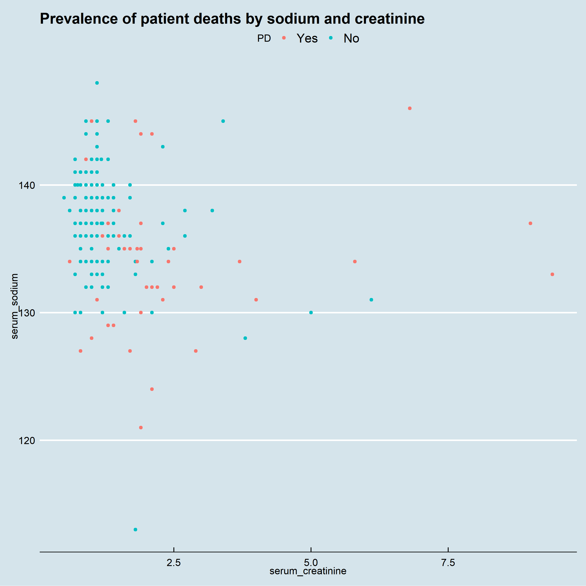

```{r setup, include=FALSE}
knitr::opts_chunk$set(fig.pos = "H")
if(!require(ggplot2)) install.packages("ggplot2")
if(!require(tidyverse)) install.packages("tidyverse")
if(!require(caret)) install.packages("caret")
if(!require(dslabs)) install.packages("dslabs")
if(!require(ggcorrplot)) install.packages("ggcorrplot")
if(!require(leaps)) install.packages("leaps")
if(!require(rpart)) install.packages("rpart")
if(!require(randomForest)) install.packages("randomForest")
if(!require(e1071)) install.packages("e1071")
if(!require(kableExtra)) install.packages("kableExtra")
if(!require(rmdformats)) install.packages("rmdformats")
if(!require(knitr)) install.packages("knitr")

library(ggplot2)
library(ggthemes)
library(tidyverse)
library(caret)
library(dslabs)
library(ggcorrplot)
library(MASS)
library(leaps)
library(rpart)
library(rpart.plot)
library(randomForest)
library(e1071)
library(kableExtra)
library(rmdformats)
library(knitr)
```

# Abstract
Heart failure means that the heart is unable to pump blood around the body properly. It usually occurs because the heart has become too weak or stiff. Heart failure is a long-term condition that tends to get gradually worse over time. If we can identify the key metrics that lead to heart failure, then we can potentially provide healthcare and solutions proactively before the event occurs.

# Introduction
This report aims to construct a Machine Learning model which will predict whether a person will suffer fatal heart failure upon their next hospital visit.
The data being used here is the [Heart Failure Dataset](https://www.kaggle.com/andrewmvd/heart-failure-clinical-data) on Kaggle.

For this report, the Heart Failure dataset is split into a training and a validation set (`train` and `validation` respectively). Only the `train` data set is used for model construction. The `validation` data set is used only for assessing the performance of the *final* model. `train` is split into `heart_train` and `heart_test`. Various models are constructed using `heart_train` and their performances are assessed using `heart_test`. The best performing model is then retrained using `train` and assessed using `validation`. This way, `validation` has no effect on which model is selected to be the final model. The R code used to construct these data sets, models and plots is available in [this](https://github.com/Where-the-code-resides/Edx-ML-Capstone/tree/main/heart-failure-project) GitHub repo.

`validation` is 20% of the entire data set and `heart_test` is 20% of `train`. The reason 20% is used for testing and validating in this report is because the data set is quite small. Using 20% instead of 10% for example gives more data to assess the performance of the models. 


# Data Exploration
The structure of the `train` dataset is shown below.
"PD" is the predictor variable: "Yes" indicates the patient has passed away. 


The features are made up of age, gender (biological sex), a selection of conditions (including anaemia, high blood pressure and diabetes), as well as measurements of fluids such as creatinine phosphokinase, sodium and creatinine. The data contains observations from 299 patients, 32% of which have passed. It's hard to tell whether this is reflective of the true mortality rate for heart failure as the rate differs over time. 

```{r loading_data, echo = FALSE, fig.pos = "H"}
load("rda_files/structure.rda")
load("rda_files/opt_values.rda")
load("rda_files/models.rda")
load("rda_files/matrices.rda")
load("rda_files/results.rda")
str(heart)
```

The images below show a correlation plot of the factor and continuous features respectively. The non-continuous correlations are left blank:

\begin{figure}
\includegraphics{images/correlation.png}
\caption{Correlation plot of factor variables in the Heart Failure dataset.}
\end{figure}

\begin{figure}
\includegraphics{images/correlation2.png}
\caption{Correlation plot of factor variables in the Heart Failure dataset.}
\end{figure}

We will now look at each variable in turn then look at the significant relationships between some of the variables as shown in the correlation plots.

Starting off with Gender: The death rates between genders are equal:


\begin{figure}
\includegraphics{images/gender.png}
\caption{Number of Patient deaths by Gender}
\end{figure}


The distribution of both survivals/deaths by age seem to follow a similar pattern, with the majority of patients being 60-65 years old. However, there are more people past this age-range that have died than surived in this dataset:


There doesn't seem to be much of a difference of creatinine phosphokinase levels between alive/dead patients:


Those who die have a lower ejection fraction on average than those who have survived:


The platelet count does not appear to be a significant factor in survival:


The levels of creatinine are higher in those who die:


The level of sodium is lower on average in those who die:


Now looking at the significant correlations between explanatory variables.

Women with diabetes are more likely to die than men with diabetes, but men are more likely to die overall:


Women who smoke more likely to die than men who smoke (very small sample size, however):




Those with diabetes who also smoke are at most risk:


Not a strong relationship between sodium levels and age - correlation likely due to outliers:


Also a weak correlation between levels of sodium and creatinine:




There is less sodium in the blood of those who die, this could be due to a weak heart not being able to pump blood efficiently around the body, as the plot below suggests:


# Machine Learning Overview: Performance Measurement
We will focus on two metrics to assess the performance of our machine learning models: 

1) **Accuracy**, which is the proportion of correctly classified events. 

2) **Sensitivity**, which is the proportion of 'positive events' (i.e. the event of importance) that are correctly classified.In this exercise, the positive event is a patient passing away (PD = 1).

This report aims to maximise the mean of the accuracy and the sensitivity. 10-fold cross-validation is used to choose the ideal hyperparameters (where applicable) which maximise the mean of the accuracy and the sensitivity. 

# Approach 1: Logistic Regression
The first model we'll build will be a logistic regression model. Logistic Regression is a statistical model that in its basic form uses a logistic function to model a binary dependent variable  $Y$. For our dataset, the dependent variable is PD.

We assume a linear relationship between the explanatory variables and the log-odds (also called logit) of the event that $Y = 1$. This linear relationship can be written in the following mathematical form (where $l$ is the log-odds, $b$ is the base of the logarithm, and $\beta _{i}$ are parameters of the model):

\begin{equation}
l = \log_{b}{\frac {p}{1 - p}}= \beta_{0} + \beta_{1}x_{1} + \beta_{2}x_{2}
\end{equation}

One choice that has to be made when constructing a logistic regression model is what cutoff to use. The cutoff $p$ is such that $\hat{\pi}_i>p\Rightarrow$ observation $i$ is classed as positive. A typical choice is 0.5, however the context of this problem gives reason to consider a value lower than 0.5. Not identifying a person at risk of heart failure is more costly than incorrectly classifying someone who is not at risk. 

10-fold cross-validation is used to find the optimal p. The figure below shows the results for various cutoffs:


The summary of the model, trained on `heart_train` is shown below:

```{r logistic, echo = FALSE, fig.pos = "H"}
summary(model_glm)
```


The summary indicates that a lot of the features aren't statistically significant (p value > 0.05). We will try training the model again, but only using features that are deemed statistically significant:


The summary of the refined model is shown below:

```{r logistic 2, echo = FALSE, fig.pos = "H"}
summary(model_glm_two)
```


The confusion matrix below indicates that the glm model performs significantly better than our original model:


```{r cm_glm, echo = FALSE, fig.pos = "H"}
cm_glm
```


The accuracy & sensitivity of our first model is shown in the table below:

```{r results1, echo = FALSE, fig.pos = "H"}
results %>%
  slice(1) %>%
  kable(caption = "Results after construction of the first model.")%>%
  kable_styling(latex_options = "HOLD_position")
```
# Approach 2: Naive Bayes 

Naive Bayes is a simple technique for constructing classifiers: Classifiers are models that assign class labels to problem instances, represented as vectors of feature values, where the class labels are drawn from some finite set. 

There is not a single algorithm for training such classifiers, but a family of algorithms are based on a common principle: all naive Bayes classifiers assume that the value of a particular feature is independent of the value of any other feature, given the class variable. 

Abstractly, Naïve Bayes is a conditional probability model: given a problem instance to be classified, represented by a vector $\mathbf {x} =(x_{1},\ldots ,x_{n})$  representing some $n$ features (independent variables), it assigns to this instance probabilities:

\begin{equation}
p(C_{k}\mid x_{1},\ldots ,x_{n})\,
\end{equation}

for each of $k$ possible outcomes or classes $C_{k}$.The problem with the above formulation is that if the number of features n is large or if a feature can take on a large number of values, then basing such a model on probability tables is infeasible. We therefore reformulate the model to make it more tractable. Using Bayes' theorem, the conditional probability can be decomposed as

\begin{equation}
 p(C_{k}\mid \mathbf {x} )={\frac {p(C_{k})\ p(\mathbf {x} \mid C_{k})}{p(\mathbf {x} )}}\,
\end{equation}

10-fold cross-validation is used to assess which naive bayes model provides the highest accuracy. The figure below shows that the non-parametric model performs much better than the Gaussian Naive Bayes model:


The confusion matrix for this model is shown below:

```{r cm_nb,echo=FALSE}
cm_nb
```


The accuracy & sensitivity of the second model is shown in the table below:

```{r results2, echo = FALSE, fig.pos = "H"}
results %>%
  slice(1:2) %>%
  kable(caption = "Results after construction of the second model")%>%
  kable_styling(latex_options = "HOLD_position")
```

# Approach 3: Decision Tree
A decision tree is a decision support tool that uses a tree-like model of decisions and their possible consequences, including chance event outcomes. Decision trees are commonly used in operations research, specifically in decision analysis. One advantage of decision trees is that they are highly interpretable. The way in which decision trees make classifications is in line with how many people would expect doctors to predict the class of a potentially at-risk patient. The rpart package [[6](https://cran.r-project.org/web/packages/rpart/rpart.pdf)] is used to construct the decision tree. 

The decision that has to be made when constructing a decision tree model is what complexity parameter (the factor by which the model's performance needs to improve by to warrant another split) to use. Bootstrap (25 samples of 25% of the data set) is used to select the optimal complexity parameter. 

The default approach taken by the `train` function in the caret package is to use a `minsplit` of 20 and `minbucket` of 7. The results of the bootstrap are shown in Figure 10, indicating that `r opt_cp` is the optimal choice.


The image below illustrates exactly how the tree makes decisions. The root node makes the first split based on the patient's serum creatinine levels. If it's about 1, they are classed as being at risk. If not, a further split is made based on the patient's ejection_fraction, and so on. The percentage at the bottom of each leaf is the proportion of observations in `heart_train` that lie in that leaf. The decimal above the percentage is the proportion of observations in that leaf that survived.


The confusion matrix for this model is shown below:

```{r cm_tree,echo=FALSE}
cm_tree
```

The accuracy & sensitivity of the model is shown in the table below:


```{r results3, echo = FALSE, fig.pos = "H"}
results %>%
  slice(1:3) %>%
  kable(caption = "Results after construction of the third model")%>%
  kable_styling(latex_options = "HOLD_position")
```
 

# Approach 4: Random Forest

This model is an extension of the decision tree - a random forest is a collection of decision trees. The way the random forest makes predictions is by some form of majority vote among all of the trees. Trees are constructed in a similar way as the previous section, however at each node a random subset of features is chosen to make the split. This increases the independence between the trees (this parameter is `mtry` in the randomForest package [[8](https://cran.r-project.org/web/packages/randomForest/randomForest.pdf)]). 

Again, bootstrap (25 samples of 25%) is used to choose an optimal `mtry`. The randomForest package takes the default `nodesize` (minimum size of terminal nodes) to be 1 and the default `ntree` (number of decision trees in the forest) to be 500. 10-fold cross validation is used to calculate the optimal `mtry` that maximises the accuracy.The results are shown below in Figure 21:


The confusion matrix below indicates that the random forest performs very well in comparison to the previous models. it achieves an accuracy of 0.79. 


```{r cm_rf, echo = FALSE, fig.pos = "H"}
cm_rf
```


Table 4 shows the performances of the four models:

```{r results4, echo = FALSE, fig.pos = "H"}
results %>%
  slice(1:4) %>%
  kable(caption = "Results after construction of the fourth model")%>%
  kable_styling(latex_options = "HOLD_position")
```

# Approach 5: Support-Vector Machine
A support-vector machine constructs a hyperplane or set of hyperplanes in a high- or infinite-dimensional space, which can be used for classification, regression, or other tasks like outliers detection. Intuitively, a good separation is achieved by the hyperplane that has the largest distance to the nearest training-data point of any class (so-called functional margin), since in general the larger the margin, the lower the generalization error of the classifier.

Given a training set of $n$ points of the form

\begin{equation} 
(\mathbf {x} _{1},y_{1}),\ldots ,(\mathbf {x} _{n},y_{n}),
\end{equation}

where the $y_{i}$ are either 1 or −1, each indicating the class to which the point $\mathbf {x} _{i}$ belongs. Each $\mathbf {x} _{i}$ is a $p$-dimensional real vector. We want to find the "maximum-margin hyperplane" that divides the group of points $\mathbf {x} _{i}$ for which $y_{i}=1$ from the group of points for which $y_{i}=-1$ (i.e. separate the groups of patients that died or surived), which is defined so that the distance between the hyperplane and the nearest point $\mathbf {x} _{i}$ from either group is maximized.

Any hyperplane can be written as the set of points $\mathbf {x}$  satisfying:

\begin{equation} 
\mathbf {w} ^{T}\mathbf {x} - b=0,
\end{equation} 

where $\mathbf {w}$  is the (not necessarily normalized) normal vector to the hyperplane.

The goal of the optimization then is to minimize

\begin{equation} 
\left[{\frac {1}{n}}\sum _{i=1}^{n}\max \left(0,1 - y_{i}(\mathbf {w} ^{T}\mathbf {x} _{i}-b)\right)\right]+\lambda \lVert \mathbf {w} \rVert ^{2},
\end{equation} 

where the parameter $\lambda$ (the cost parameter) determines the trade-off between increasing the margin size and ensuring that the ${x}_{i}$ lie on the correct side of the margin. 10-fold cross-validation is used to choose the cost value that maximises the accuracy of the model. The results are shown below:


The results of the Support-Vector Machine are shown below:
```{r cm_svm, echo = FALSE, fig.pos = "H"}
cm_svm
```

Table 5 shows the performances of the five models:

```{r results5, echo = FALSE}
results %>%
  slice(1:5) %>%
  kable(caption = "Results after construction of the fifth model")%>%
  kable_styling(latex_options = "HOLD_position")
```

# Approach 6: Ensemble

The final model is an ensemble of the three best performing models. Since the Logistic Regression and Support-Vector machine models performed the worst, they are omitted from the ensemble. 

The ensemble takes a majority vote for each observation from the three models (Naive Bayes, decision tree and random forest) and uses that as its prediction. By dropping two models ties are avoided. Ensembling machine learning models is a great strategy to improve accuracy on test sets - it reduces the reliability on the performance of only one algorithm.

The confusion matrix below shows that the ensemble does indeed provide the best average accuracy and senstivity:


```{r cm_ens, echo = FALSE}
cm_ens
```


```{r results6, echo = FALSE}
results %>%
  slice(1:6) %>%
  kable(caption = "Results after construction of all the models")%>%
  kable_styling(latex_options = "HOLD_position")
```

# Final Model (Results)

In typical data science projects, it is usually the case that the ensemble achieves the best results. Thus, it is selected to be the final model.

The entire `train` data set is now used to construct a random forest. The Naive Bayes, Decision tree and Random Forest models are constructed in the same manner they were constructed on the `heart_train` dataset.

The confusion matrix indicates that the ensemble achieves 77% accuracy and 50% Sensitivity:

```{r cm_final, echo = FALSE}
cm_ens_final
```


# Conclusion
Though we've made a model that performs 27% better than guessing, there are ways in which we can achieve a greater level of accuracy and specificity:

## Sample Size
The `heart_train` data set only has 299 observations. Furthermore, the final model is only tested on 78 observations. With a much larger dataset, we would be able to calculate more accurate hyperparamters and thus achieve higher accuracy.


## More relevant features 
We saw in our various models that a lot of the features in our dataset do not appear to be significant risks towards heart failure. If we had more variables to assess (such as height, BMI, location) we may be able to construct a more powerful model.


