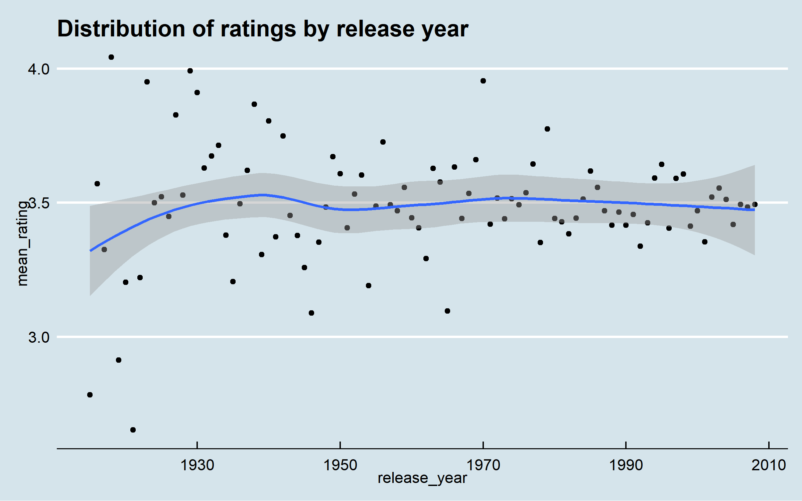
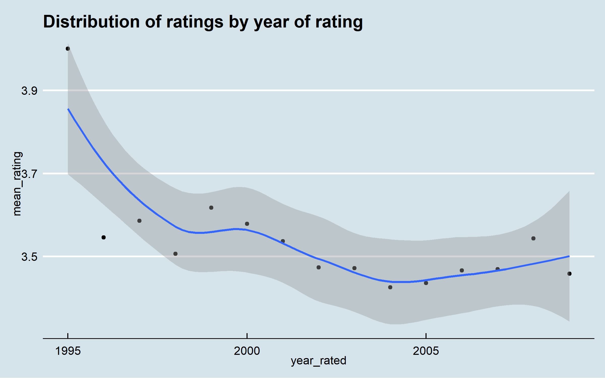
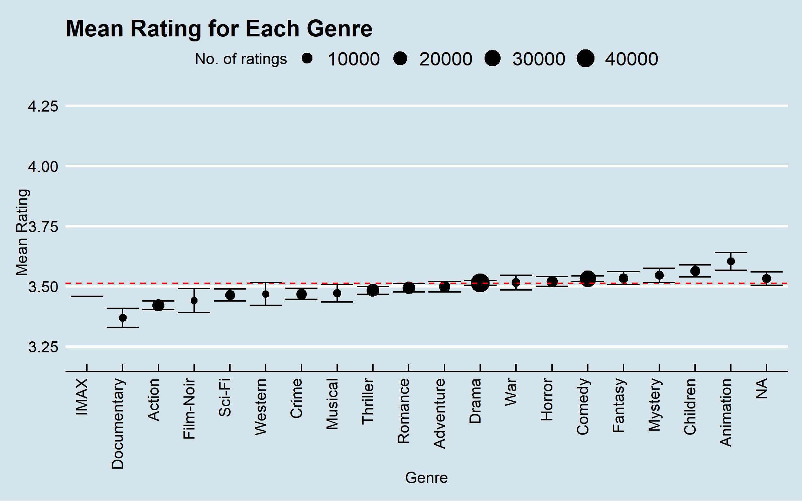
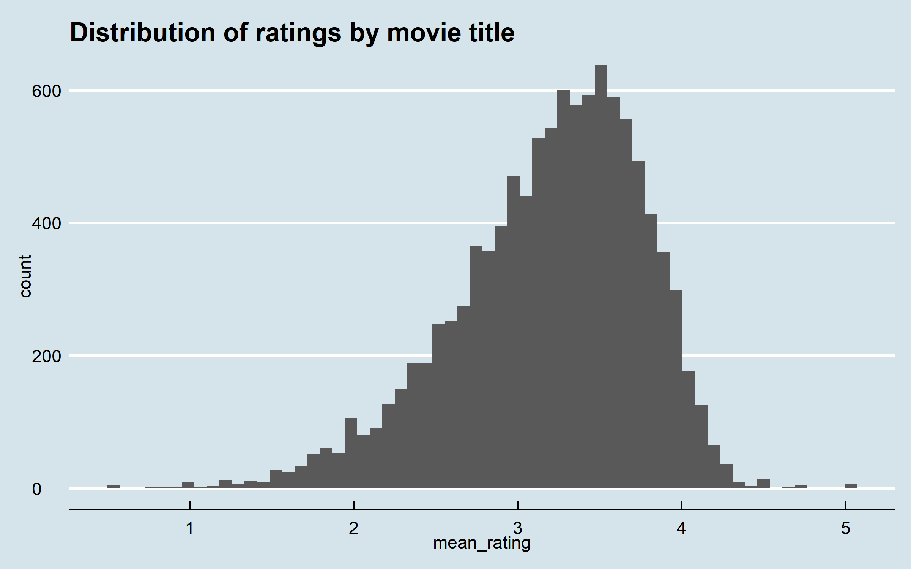
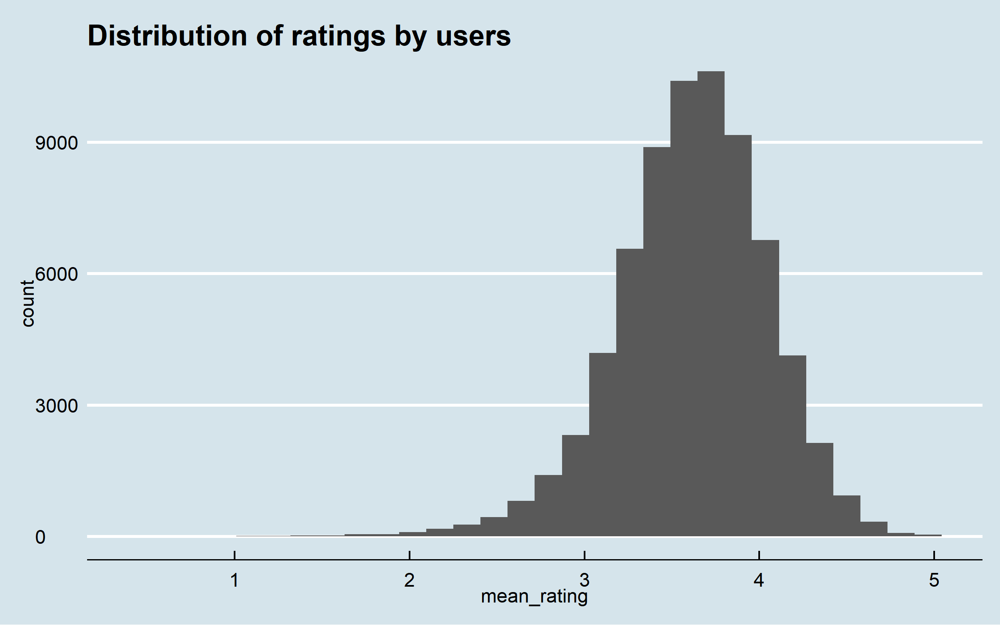

```{r setup, include=FALSE}
knitr::opts_chunk$set(echo = TRUE)

if(!require(tidyverse)) install.packages("tidyverse", repos = "http://cran.us.r-project.org")
if(!require(caret)) install.packages("caret", repos = "http://cran.us.r-project.org")
if(!require(data.table)) install.packages("data.table", repos = "http://cran.us.r-project.org")
if(!require(ggthemes)) install.packages("ggthemes")


library(tidyverse)
library(caret)
library(data.table)
library(lubridate)
library(ggthemes)
library(knitr)
library(kableExtra)

knitr::knit_hooks$set(plot = function(x, options)  {
  paste0(knitr::hook_plot_tex(x, options), "\n\\FloatBarrier\n")
})


```

# Introduction
This report aims to construct a recommendation model which would be able to predict the rating a user would give a film they haven't seen before.

The data being used here is the [MovieLens 10M Dataset](https://grouplens.org/datasets/movielens/10m/).

For this report, the MovieLens dataset is split into a training and a validation set (`edx` and `validation` respectively). Only the `edx` data set is used for model construction. The `validation` data set is used only fedx` is split into `train` and `test`. Various models are constructed using `train` and their performances are assessed using `test`. The best performing model is then retrained using `edx` and assessed using `validation`. This way, `validation` has no effect on which model is selected to be the final model. The R code used to construct these data sets, models and plots is available in [this](https://github.com/Where-the-code-resides/Edx-ML-Capstone/tree/main/movielens-project) GitHub repo.


# Data Exploration
The structure of the `edx` dataset is shown below.
"rating" is the predictor variable, which can be a value between 0 and 5. 

The features include the user ID and movie ID, as well as the year the rating was given, and the year the film was released

```{r loading_data, echo = FALSE}
load("rda_files/predictions.rda")
load("rda_files/opt_values.rda")
load("rda_files/rmse_results.rda")
load("rda_files/rmse_values.rda")
load("rda_files/edx_str.rda")
edx_str
```


We will now look at each variable in turn and look for and significant patterns.

Starting off with the film release year - there doesn't seem to be much change over the years:
<p>

</p>


Rating year - ratings seem to be getting slightly more harsh over time:
<p>

</p>

Genre - there doesn't seem to be a significant difference across genres:

<p>

</p>


Movies - some movies are rated more highly than others, which is expected:
<p>

</p>

Users - some users rate more films than others:

<p>

</p>


# Machine Learning Overview: Performance Measurement
We need a metric to assess the performance of our machine learning models: 

For this exercise, we will be using the **Root Mean Squared Error (RMSE)**, which is the square root of the average of squared errors. 
The smaller the RMSE, the more accurate the model is performing. We thus aim to minimise the RMSE; 5-fold cross-validation is used to choose the ideal hyperparameters (where applicable) that achieve this.
  

# Model 1: Just the Average

The first algorithm we will use will be the average rating across all films in the `edx_train` data set. Our predictions will be therefore generated by this equation:

\begin{equation}
  r_{u,m}=\mu +\epsilon_{u,m}
\end{equation}

where $r_{u,m}$ is the rating given by user $u$ for movie $m$, $\mu$ is the mean user rating for `edx_train` and $\epsilon$ is the error for a user's rating for a given movie.

The table below shows that we get a RMSE of `r rmse_mean`

```{r rmse_1, echo=FALSE}
kable(rmse_results %>% slice(1), caption = "Table 1: RMSE result after first model.") %>%
  kable_styling(latex_options = "HOLD_position")
```


# Model 2: Movie Bias 

The next model will account for the bias across films. Some films are rated more highly than others, as the movie histogram showed. A model that takes this into account is likely to be more accurate than creating predictions with just the mean. Our new equation becomes:

\begin{equation}
  r_{u,m}=\mu + \beta_m + \epsilon_{u,m}
\end{equation}

where $\beta_m$ is the bias for movie $m$.

The table below shows that this model performs signifcantly better than the first, with an RMSE of `r rmse_movie_bias`:

```{r rmse_2, echo=FALSE}
kable(rmse_results %>% slice(1:2), caption = "RMSE result after second model.")%>%
  kable_styling(latex_options = "HOLD_position")
```

# Model 3: Movie and User Bias

As well as there being bias across films, there is also bias across users, as the user-rating histogram shows. Some users are tough critics and rate films poorly, whilst other users rate a lot of films highly. We can improve on our previous model and add a bias term which accounts for this different in rating behaviour:

\begin{equation}
  r_{u,m}=\mu + \beta_m + \beta_u + \epsilon_{u,m}
\end{equation}

where $\beta_u$ is the bias for user $u$

Again, we see an improvement in our RMSE with this model generating an RMSE of `r rmse_movie_user_bias`:

```{r rmse_3, echo=FALSE}
kable(rmse_results %>% slice(1:3), caption = "RMSE result after third model.") %>%
  kable_styling(latex_options = "HOLD_position")
```


# Model 4: Regularised Movie Bias

So far, one thing we haven't considered in our models are outliers in our data. For example, niche films which haven't been seen by many users will have a small number of ratings. If those small number of users rate that film highly, then our algorithm may incorrectly suggest that another user may also like the film as much. This is a similar case for bad ratings for films many haven't seen. 

This is where **regularisation** comes in. The general idea behind regularisation is to constrain the total variability of the effect sizes by adding a penalty variable. In the context of this exercise, the general idea of the penalty variable is to control the total variability of the movie effects. Thus, instead of minimizing the least squares equation as before, we minimize an equation that adds a penalty. Our new equation now becomes:

\begin{equation}
  \frac{1}{N}\sum_{u,m}(r_{u,m}-\mu -\beta_m)^2 + \lambda\sum_m\beta_m^2
\end{equation}


where $\lambda$ is a tuning parameter which determines how much 'unreliable' parameter estimates are penalised. Using calculus, we can show that the values of $\beta_m$ that minimize this equation are:

\begin{equation}
  \hat{\beta}_m (\lambda) = \frac{1}{\lambda+n_m} \sum_{u=1}^{n_m}(R_{u,m}-\hat{\mu} )
\end{equation}

where $n_m$ is the number of ratings for movie $m$.

Note that when $n_m$ is small (not many people have rated the movie), $\lambda$ is having a more significant impact. When $n_m$ is large (many people have rated the movie), the effect $\lambda$ has becomes negligible. The equation also illustrates that a large value of $\lambda$ results in more shrinking (more skepticism).

To find the optimal $\lambda$ for this model that minimises the RMSE, we use 5-fold cross-validation. The results are shown below. 


This model does not perform as well as our previous model which accounts for movie and user bias, but performs better than our original movie bias model, generating an RMSE of `r rmse_movie_bias_reg`:

```{r rmse_4, echo=FALSE}
kable(rmse_results %>% slice(1:4), caption = "RMSE result after fourth model.")%>%
  kable_styling(latex_options = "HOLD_position")
```

# Model 5: Regularised Movie and User Bias

Similar to there being variability between the number of ratings for a film, there can also be variablity with the number of ratings users give. We can use regularisation to account for this variablity. For this model, we will keep the $\lambda$ for the movie bias fixed (and call it $\lambda_1$), and introduce another variable, $\lambda_2$, to determine how much a user rating should be penalised. 
Our new equation becomes:

\begin{equation}
  \frac{1}{N}\sum_{u,m}(r_{u,m}-\mu -\beta_m - \beta_u)^2 + \lambda_1\sum_m\beta_m^2 + \lambda_2\sum_u\beta_u^2 
\end{equation}

Similar to the previous model, we use 5-fold cross-validation to find the optimal $\lambda_2$. The results are shown below:


As expected, this model performs better than all of the previous models, generating an RMSE of `r rmse_movie_user_bias_reg`:

```{r rmse_5, echo=FALSE}
kable(rmse_results %>% slice(1:5), caption = "RMSE result after fifth model.")%>%
  kable_styling(latex_options = "HOLD_position")
```

# Final Model (Results)

The best performing model is the [Regularised Movie and User Bias] model, which yields an RMSE of `r rmse_movie_user_bias_reg`. Therefore, it is chosen as the final model. The final model is constructed using the entire `edx` data set and is then evaluated using `validation`. We use the same values for $\lambda_1$ and $\lambda_2$ found using the `edx_train` when creating the model using the entire `edx` dataset. 

As shown in the table below, the final model achieves an RMSE of `r rmse_movie_user_bias_reg_final`:

```{r rmse_6, echo=FALSE}
kable(rmse_results %>% slice(1:6), caption = "RMSE results after final model.")%>%
  kable_styling(latex_options = "HOLD_position")
```


# Conclusion

This report explores a few methods used to construct a recommendation system. The best performing model in this report is the [Regularised Movie and User Bias] model, which yields an RMSE of `r rmse_movie_user_bias_reg_final` when trained on `edx` and tested on `validation`. This is a significant an improvement on the first model's RMSE.

However, there are ways we can achieve even better results:

1) **More computational power**. With more power, we could use more sophisticated algorithms, such as K-nearest neighbours or Support Vector Machine to generate more accurate predictions. However, due to the sheer size of this dataset, it is infeasible to perform these on a domestic laptop

2) **More features**. More applicable features may give us more insight into rating behaviours. For example: Do ratings patterns differ with age? What about ethnicity? These findings could allow us to generate more accurate results.

